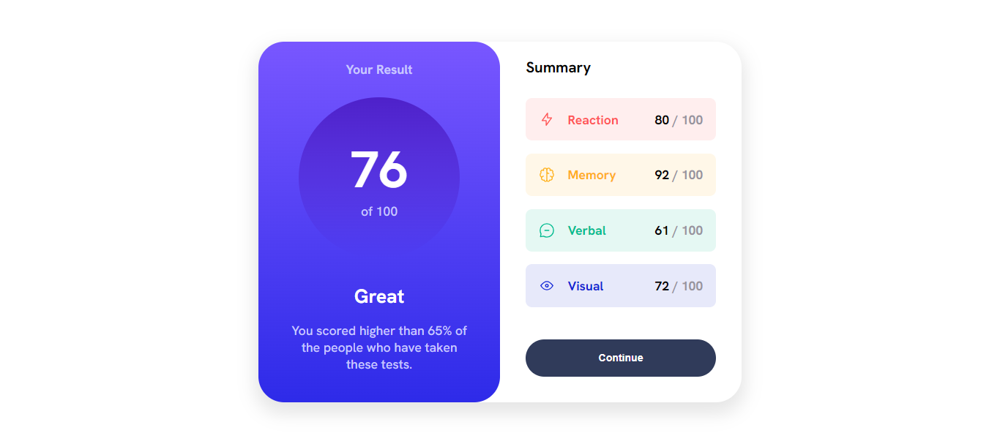
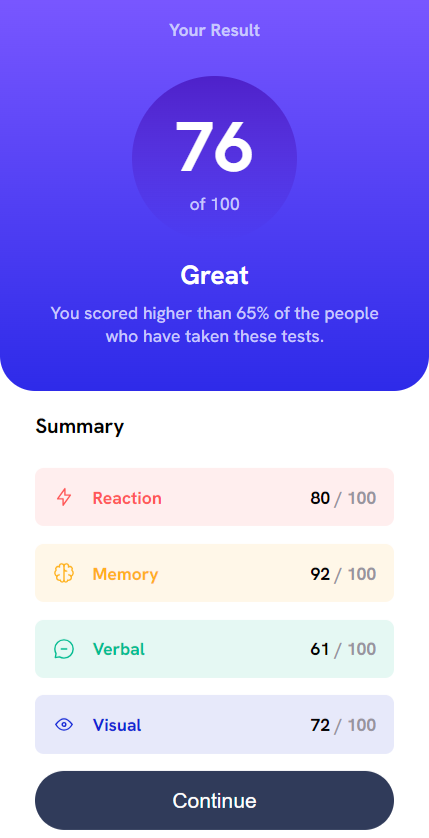

# Frontend Mentor - Results summary component solution

This is a solution to the [Results summary component challenge from Frondmentor.io](https://www.frontendmentor.io/challenges/results-summary-component-CE_K6s0maV).

## Table of contents

- [Overview](#overview)
  - [Screenshot](#screenshot)
  - [Links](#links)
- [My process](#my-process)
  - [Built with](#built-with)
  - [What I learned](#what-i-learned)
- [Author](#author)
- [Acknowledgments](#acknowledgments)

## Overview

### Screenshot

### Links

- Solution URL: (https://github.com/gmenesesdev/results-summary-component-main-frondmentor.io)
- Live Site URL: (https://gmenesesdev.github.io/results-summary-component-main-frondmentor.io/)

## My process

### Built with

- HTML5
- CSS
- Flexbox
- Root variables

### What I learned

Some changes are made and improvements implemented in relation to previous projects I have done. I will continue to make improvements in upcoming projects.

If you have any comments, please tell me.

## Author

- Frontend Mentor - [@gmenesesdev](https://www.frontendmentor.io/profile/gmenesesdev)
